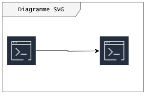

# Contexte technologique

La manière dont un projet s'inscrit dans un contexte technique et technologique est sans doute l'un des points à analyser les plus pertinents. Les choix et la mise en oeuvre peut, dès les premières décisions, lourdement avantager ou pénaliser le projet.

- [x] Il peut être intéressant de lister quels éléments sont achevés à l'instant de rédaction
- [ ] Et lesquels ne le sont pas

## Stack actuelle

Présentez dans les grandes lignes les différentes briques techniques. 
!!! info "Important"

        ```
        Bien vérifier quelles informations peuvent être sorties du contexte projet et lesquelles sont confidentielles
        ```
    ---
### Structure technique

Il est également possible d'insérer des diagrammes direcement sous format svg, par exemple quand ils ont été exportés depuis draw.io.



### Architecture Decision Records

Les ADR sont une manière d'historiser les décisions prises vis à vis du projet. Elles couvrent quatre aspects : 
* Contexte et problématique
* Options considérées
* Décision
* Conséquence
Ce format permet à l'équipe de bien comprendre pourquoi et comment elle est arrivée à cette situation, et aux intervenants et collaborateurs extérieurs de mieux comprendre la logique décisionnelle.

## Ecosystème 

L'écosystème d'un projet est un sujet dense, tant à l'intérieur d'une structure que dans la communauté des différentes technologies au sens large. En dresser un portrait permet néanmoins une meilleure compréhension des enjeux du projet et de capter le poul des tendances liées.


