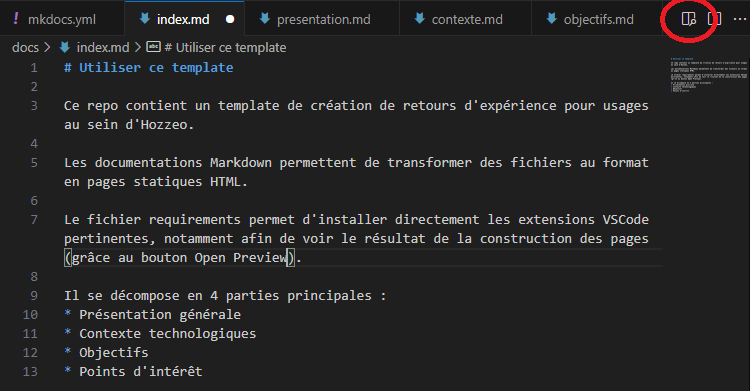

# Utiliser ce template

Ce repo contient un template de création de retours d'expérience pour usages au sein d'Hozzeo.

Les documentations Markdown permettent de transformer des fichiers au format en pages statiques HTML.

Le fichier **requirements** permet d'installer directement les extensions VSCode pertinentes, notamment afin de voir le résultat de la construction des pages (grâce au bouton Open Preview).

Il se décompose en 4 parties principales : 
 - Présentation générale
 - Contexte technologiques
 - Points d'intérêt