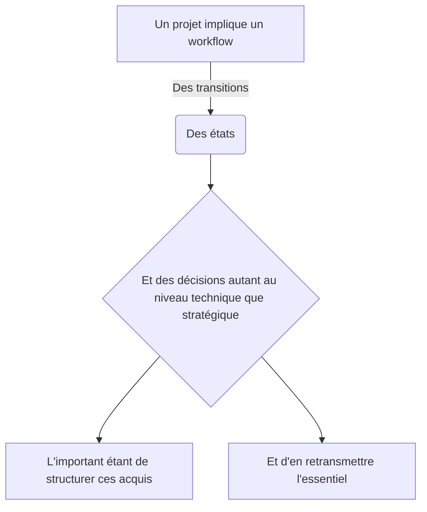

# Présentation du rex

## Client
Dans ce premier paragraphe, présentez le client/la strcture pour laquelle le projet est réalisée. L'objectif est de comprendre le **besoin du client** et sa structure.

## Généralités
Une section dédiée au généralirés sur le projet : 
- De quoi il s'agit
- Avec quelle équipe
- Pésentation "commerciale" du projet, avec ses  concepts principaux et son positionnement

### Objectifs

Comprendre els objectifs d'un projet permet de rapidement en saisir la teneur. Ses objectifs peuvent être très structurants au niveau d'une entreprise comme être de la facilitation, l'idée est ici de comprendre l'angle avec lequel le problème a été pris.

## Structure 

Markdown permet, via certaines extensions, d'intégrer des diagrammes directement dans la source. Vous pouvez expérimenter sur le site https://mermaid.live/ ou directement inline si vous avez installé les extensions issues de requirements.txt :

